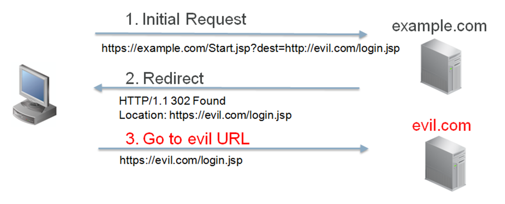
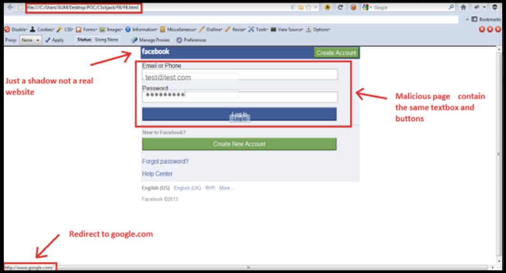
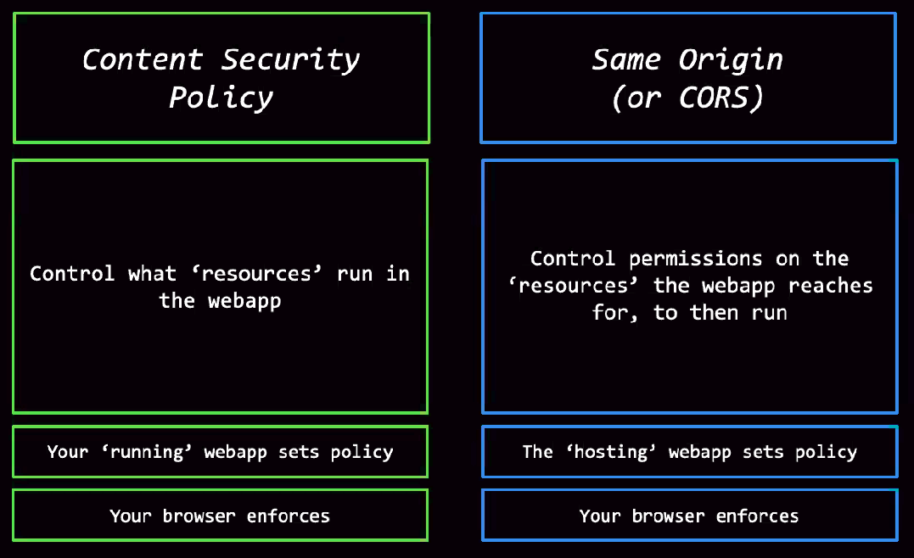

# More Client Side

## CSRF

Aim: trick the victim into performing an operation on a web application to benefit the attacker  
**Pre-conditions** for a successful attack:

* relevant action; e.g. change user email address
* session data: logged in with cookie/auth/token
* predictable parameters: no special code or token

A typical CSRF attack workflow:


Sample payload:

``` html
<html>
    <body>
        <form action=”https://vulnerable-website.com/email/change” method=”POST”>
            <input type=”hidden” name=”email” value=”pwned@evil-user.net” />
        </form>
        <script>
            document.forms[0].submit();
        </script>
    </body>
</html>
```

When a user submits the form, the following response is sent:

``` http
POST /email/change HTTP/1.1
Host: vulnerable-website.com
Content-Type: application/x-www-form-urlencoded
Content-Length: 30
Cookie: session=bwyeEnu5bcDH34w43553nYns6Sj

email=pwned@evil-user.net
```

### CSRF Defences

Add special randomised tokens for mitigation; e.g. CSRF tokens. The tokens should be

* unpredictable with high entropy for every request
* tied to a user session
* strictly validated

Example:

``` http
POST /email/change HTTP/1.1
Host: vulnerable-website.com
Content-Type: application/x-www-form-urlencoded
Content-Length: 30
Cookie: session=bwyeEnu5bcDH34w43553nYns6Sj

csrf=Wyb362SHUIshd63b23Dh8e4dehed&D&email=normal_user@allgood.net
```

## Response Splitting

**Carriage returns** (CR) are often represented as `\r` or `<CR>`  
**Line feeds** (LF) are often represented a `\n` or `<LF>`

A typical http request (showing the non-printable chars) looks like this:

``` http
POST /email/change HTTP/1.1
Host: vulnerable-website.com
Content-Type: application/x-www-form-urlencoded
Content-Length: 30
Cookie: session=bwyeEnu5bcDH34w43553nYns6Sj
\r\n\r\n
email=anyemail@anywhere.com.au
```

A HTTP redirect generally takes place as follows:



With response splitting, we are able to manipulate the header is the backend does not sanitise input:


Here's what happens when the response is split:


## Clickjacking

**Clickjacking** (or UI redress) is when we trick the user into clicking **hidden** content. CSS is used to manipulate layers and `iframe`s can be used to create hidden content.



Clickjacking attacks are possibly by framing websites. **Frame busting** is a technique used by websites and web applications to prevent their web pages from being displayed within a frame. Frame busters are implemented as JavaScript and behaviours of these scripts include:

* enforce current app window as top window
* make all frames visible
* prevent clicking on invisible frames
* intercept and flag potential attacks to users

Frame busting techniques are browser and platform dependent. Browser security settings could easily disable JavaScript. `iframe` in HTML5 also has a `sandbox` attribute, whose value is a set of allowed capabilities for the `iframe`'s content. Specifying `allow-script` or `allow-forms` for its value will neutralise frame busters.

``` html
<iframe id="victim_website" src="https://victim-website.com" sandbox="allow-forms"></iframe>
```

`allow-forms` permit specified actions within the frame

### Clickjacking Defences

**X-Frame-Options** prevents the framing of your site as an `iframe` in another website. The header provides control over the use of `iframes`.

``` http
X-Frame-Options: deny
X-Frame-Options: sameorigin
X-Frame-Options: allow-from https://normal-website.com
```

Note: `allow-from` is deprecated in favour of [CSP](#content-security-policy)

## Content Security Policy

**Content Security Policy (CSP)** enforces the loading of resources (scripts, images etc.) from trusted locations. It is effective against XSS, clickjacking etc.

There are multiple options to deliver CSP:

* HTTP header
* `<meta>` HTTP element
* CSP report only for monitoring

A simple policy with good security measures requires:

* all resource hosted in the same domain
* no inline or `eval` fro scripts and style resources

`Content-Security-Policy: default-src 'self;'` defines that only resources from the same domain can be loaded. A more granular version of this would be `Content-Security-Policy: default-src 'none'; sript-src 'self'; connect-src 'self'; img-src 'self'; style-src 'self';`

CSP vs. SOP (and CORS):



Useful links:

* [CSP Quick Reference Guide](https://content-security-policy.com/)
* [Mozilla CSP Spec](https://developer.mozilla.org/en-US/docs/Web/HTTP/CSP)

### CSP Nonce

A **CSP nonce** is an arbitrary number that can be used just once. It is base64 encoded and added to script tag attributes


### CSP against XSS

No inline code allowed:


In order to run code:

* Inline code is enabled by specifying a SHA2 hash:

    ``` http
    Content-Security-Policy: script-src 'sha256-hWEXbex0cd37bsd3bspvnrDseES3=';
    ```

* Move inline JavaScript to a separate file

    ``` html
    <script src="app.js"></script>
    ```

The following construct gets blocked by CSP

``` html
<button id="button1" onclick="doSomething()">
```

We'll need to replace it with something like this;

``` js
document.getElementById("button1").addEventListener("click", doSomething);
```

In summary:

* move all scripts (moveable) from inline to external JS files
* protect all scripts with SHA2 hash or Nonce
* always re-generate nonce for every page load
* add input validation for any user inputs
* add validation and encoding for data coming from backend

### CSP against Clickjacking

* protects your page from being framed by other sites
* prevents all framing of your content:

    ``` http
    Content-Security-Policy: frame-ancestors 'none';
    ```

* allows framing from site itself

    ``` http
    Content-Security-Policy: frame-ancestors 'self';
    ```

* allow framing from trusted domain

    ``` http
    Content-Security-Policy: frame-ancestors trusted.com;
    ```

## Reference

* [XSS prevention](https://owasp.org/www-project-cheat-sheets/cheatsheets/DOM_based_XSS_Prevention_Cheat_Sheet.html)
* [OWASP JuiceShop](https://github.com/bkimminich/juice-shop)
