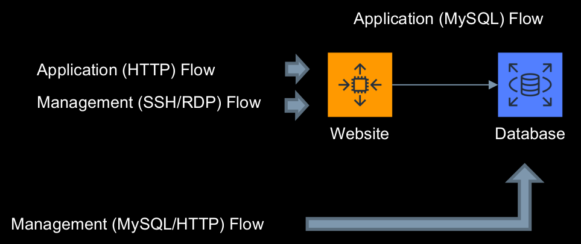
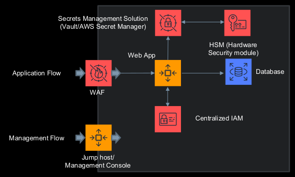
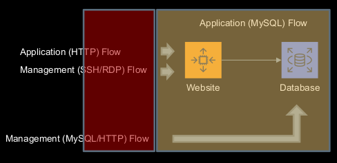
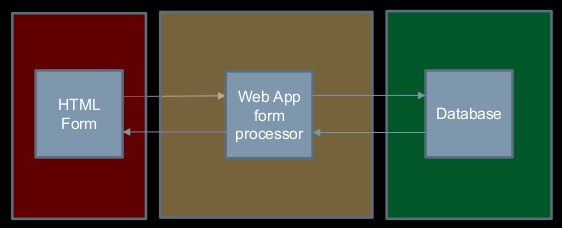
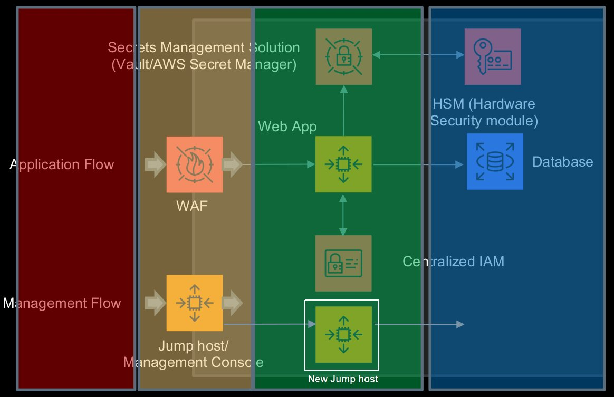

# Enterprise Security

Architecture of a webapp in 1999:

1. Website is vulnerable to command injection
2. Attacker leverages this vulnerability to download a webshell onto the server
3. The web shell will provide the functionality to login to the database and execute raw SQL queries

How can we protect the web app in the present?

* Web Application Firewall (WAF)
* Jumphost/Bastion Host
* Encryption in transit
* Encryption at rest
* Mutual (Certificate Based) Authentication
* Restricting network traffic
* Authorisation
* Anti-malware
* Centralised logging
* Secure configuration/hardening
* Identity management
* Signing
* Centralised Key Management
* Restricting or preventing Internet access

**Defence in-depth** introduces multiple layers of defence. As a result, attackers will have limited visibility into systems they're attacking, and exploits require an increased effort in order to succeed.

Architecture of a modern webapp:

## Security Zones

A **security zone** is a logical entity to which one or more interfaces are bound and provide a means of distinguishing groups of hosts (user logical systems and other hosts, such as servers), resources from one another in order to ***apply different security measures***.

The portion of the Internet that is outside the boundaries of an organisation is called the **uncontrolled zone**/**untrusted zone**. This is because there are few to no controls in place, making it vulnerable to many security breaches

Security zones of the 1999 webapp:

If we add a form processor, when handling a HTML form, we add in a security zone between the Internet and our database

Security zones of a modern webapp:

Here's how a webapp form may be protected from XSS in a modern application:

Resources:

* [UNSW Governance IT Security Standard](https://www.gs.unsw.edu.au/policy/itsecuritystandards.html)
* [SecureArc Logical Security Zone Patter](https://www.gs.unsw.edu.au/policy/itsecuritystandards.html)

## Architectural Security Controls

Here are some controls we should consider when building and attacking web application  
(yes it's the same list as before)

* Web Application Firewall (WAF)
* Jumphost/Bastion Host
* Encryption in transit
* Encryption at rest
* Mutual (Certificate Based) Authentication
* Restricting network traffic
* Authorisation
* Anti-malware
* Centralised logging
* Secure configuration/hardening
* Identity management
* Signing
* Centralised Key Management
* Restricting or preventing Internet access

### Jump Hosts and Bastion Hosts

**Jump hosts** or **bastion hosts** are generally a host which sits on the perimeter of an organisation, that will broker all privileged/management access.

It allows you to:

* create a centralised point where access to high privileged interfaces are brokered
* easily revoke access out of multiple hosts by revoking a single key/credential and/or killing an active session

It aim to help you better secure application and management flows

Our current security zones in our modern webapp, have jump host brokering access to the green zone.

If we were to add new security zone in our organisation, our current jump host would broker access to the green zone, and we would need to add a new jump host to broker access to the blue zone

### Secrets Management

Secrets include a username and password, API key or cryptographic key used by a user, administrator, or a process to access protected data.

These can easily be found in

* repositories (Github, Gitlab)
* collaboration applications
* documentation (e.g. Confluence)
* logs

It it important to store secrets into dedicated managers.

